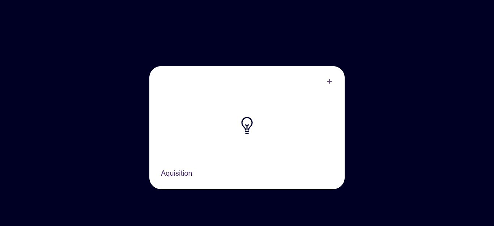

<h1> 😎 Clean CSS Card Hover Effect  </h1>

😋 Neatly designed card animation hover effect.

## Design

 </img>

## Technologies

<h2 style="color:#16b3fd">Thank You </h1>

## Connect with me:

## ❤ Views and Followers

